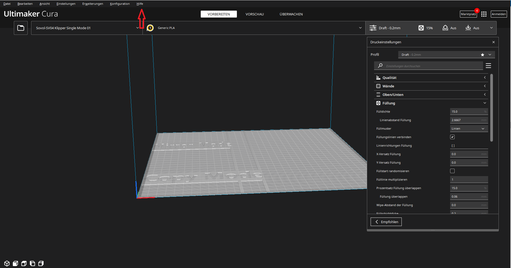
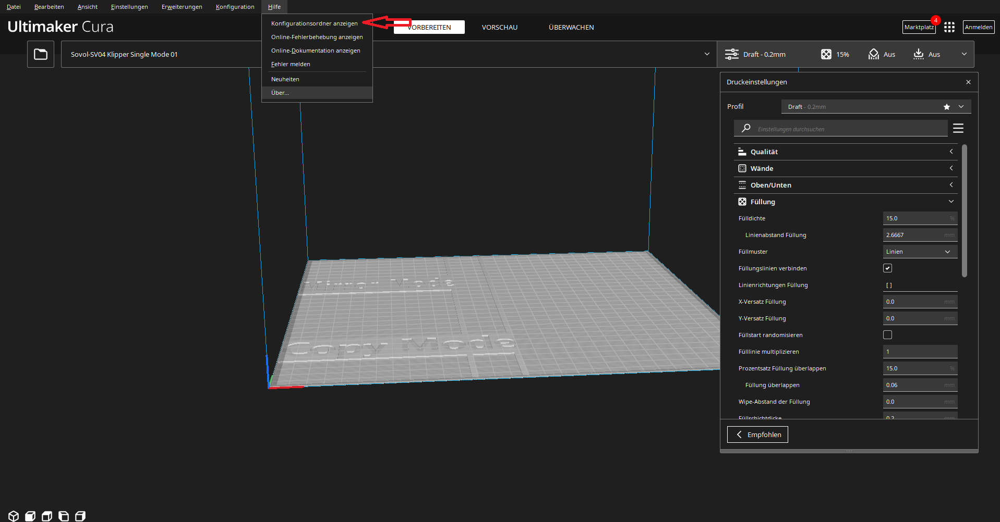
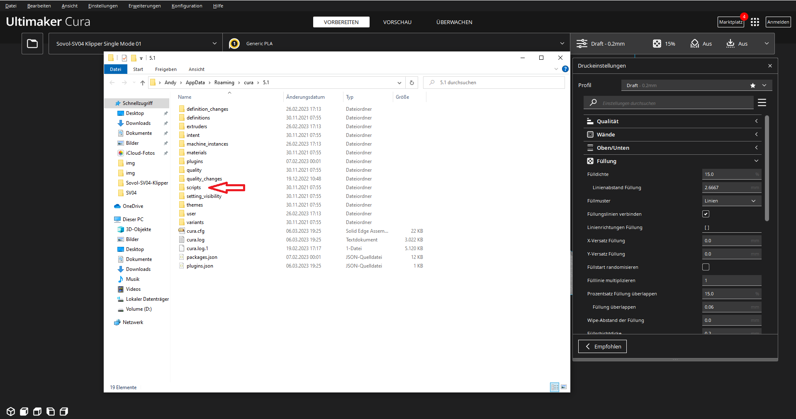
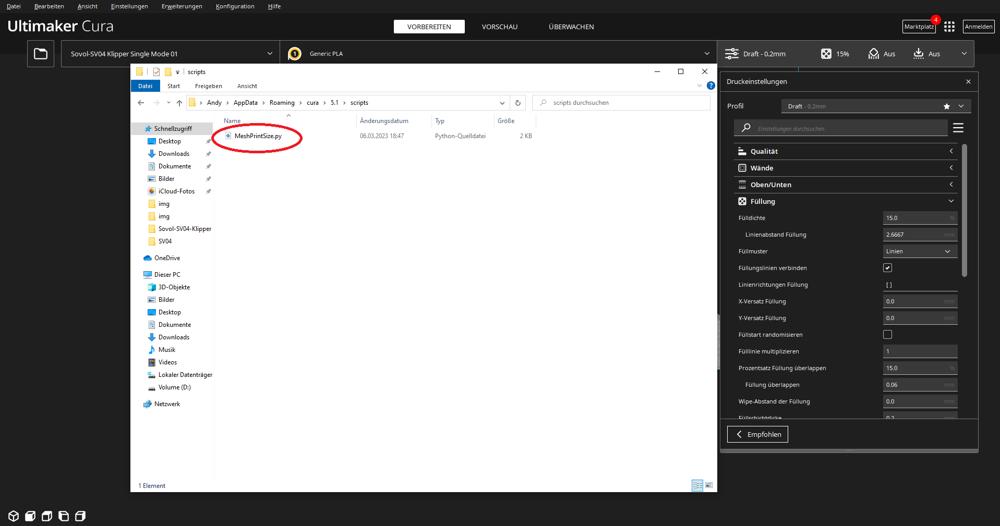
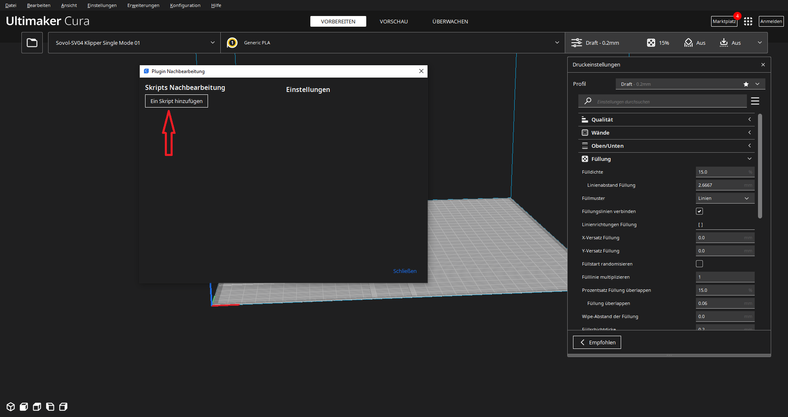
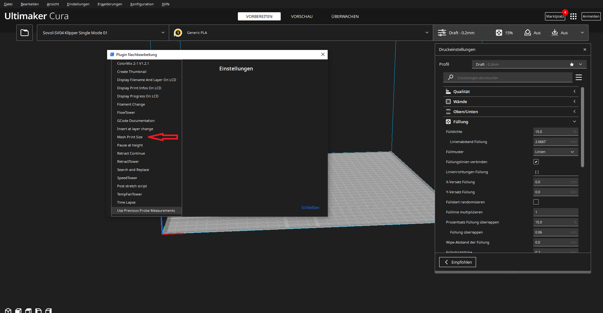
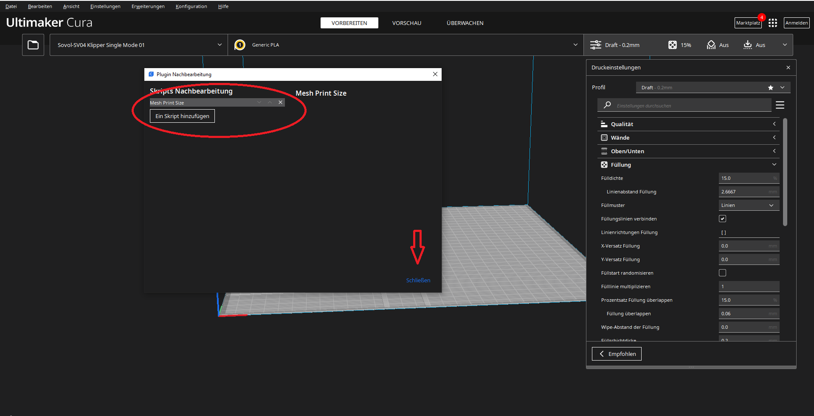
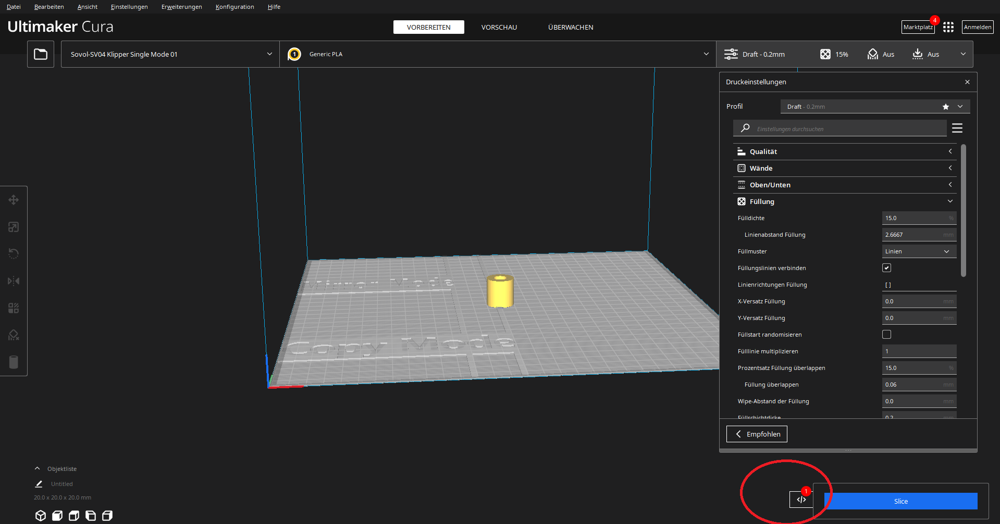

# Path for the Profiles


```sh
C:\Program Files\Ultimaker Cura 4.12.1\resources\definitions
```
```sh
C:\Program Files\Ultimaker Cura 4.12.1\resources\extruders
```
```sh
C:\Program Files\Ultimaker Cura 4.12.1\resources\meshes
```
## Path change version 5

```sh
C:\Program Files\Ultimaker Cura 5.1.0\share\cura\resources\definitions
```
```sh
C:\Program Files\Ultimaker Cura 5.1.0\share\cura\resources\extruders
```
```sh
C:\Program Files\Ultimaker Cura 5.1.0\share\cura\resources\meshes
```

## add Bed Mesh printarea

paste the file "MeshPrintSize.py" to the folder Script. Look photos






- reboot Cura





