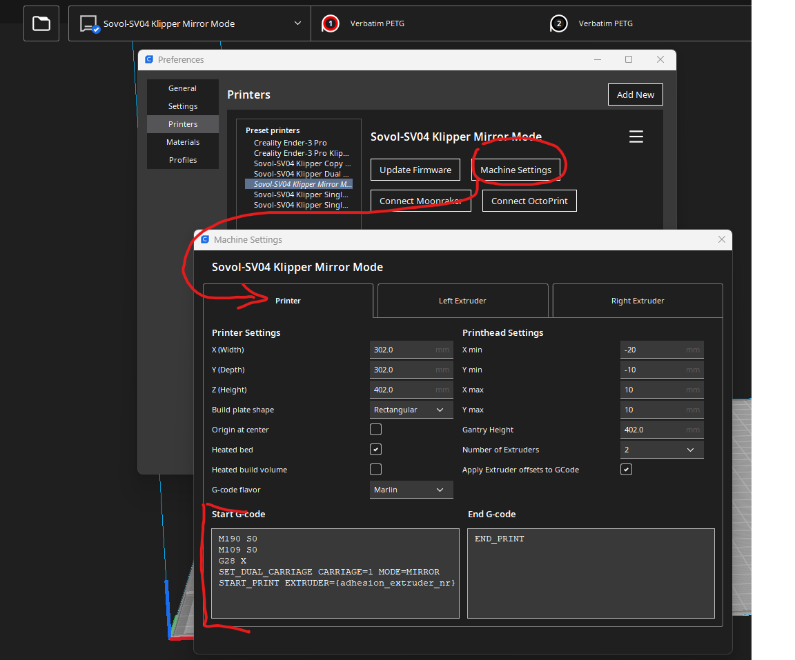

# Necessary modification to your Cura Environment

It is important to modify your Cura Slicer Environment.(Please note, that in the moment only Cura Version <= 5.2 are working corectly.)
To do that, copy the files out of the definitions, extruders and meshes directorys to the following directeroy of your Cura Installation:

# Path for the Profiles


```sh
C:\Program Files\Ultimaker Cura 4.12.1\resources\definitions
```
```sh
C:\Program Files\Ultimaker Cura 4.12.1\resources\extruders
```
```sh
C:\Program Files\Ultimaker Cura 4.12.1\resources\meshes
```
## Path change version 5

```sh
C:\Program Files\Ultimaker Cura 5.1.0\share\cura\resources\definitions
```
```sh
C:\Program Files\Ultimaker Cura 5.1.0\share\cura\resources\extruders
```
```sh
C:\Program Files\Ultimaker Cura 5.1.0\share\cura\resources\meshes
```

## add Bed Mesh printarea

paste the file "MeshPrintSize.py" to the folder Script. Look photos


- reboot Cura


## Modify your Printers Start Codes 

Paste the Start Codes from the Startcode.md Document to your coresspondending Cura Printer.
Do this Steps for Mirror, Dual and Copy Mode.

It is very important, that you have **only one GCode per line** in your Start Code Editor. Look closely at the screenshot below.
If you have more than one GCode Command in on line, the printer will not work correctly.

Here is an Example how it looks for Copy Mode:

