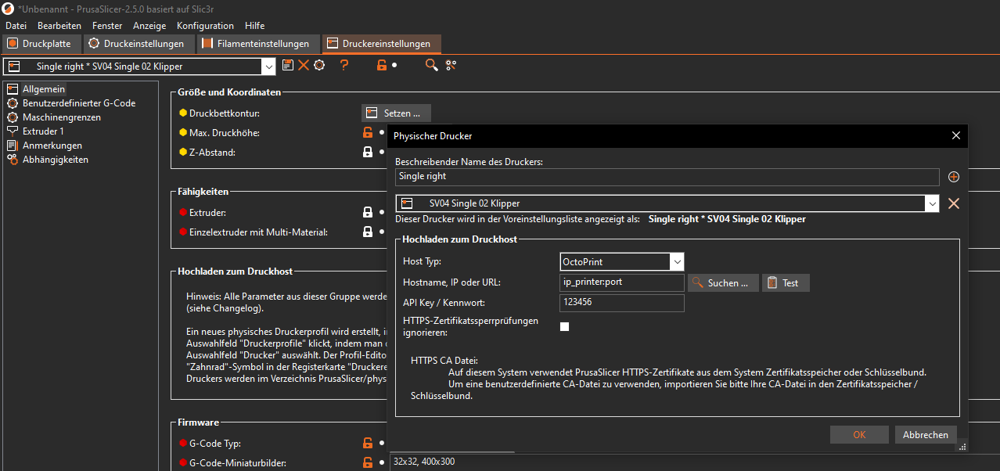

# Install Profile PrusaSlicer

## Copy and import

- First copy the folder "SV04" in the Folder path:

```sh
C:\Program Files\Prusa3D\PrusaSlicer\resources\profiles
```

- than import the "PrusaSlicer_config_bundle_SV04_Klipper.ini" in PrusaSlicer

## Use

- if you print in dual mode and dont use the other extruder select "NONE" Filament for the not used Extruder

- for the connection with klipper go to printer settings an clic the cog wheel.




