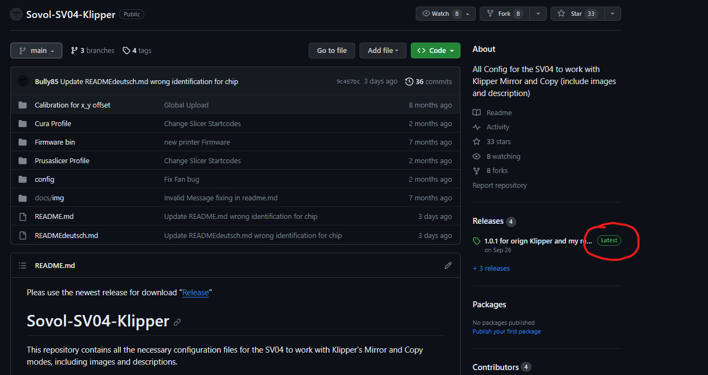

# Sovol-SV04-Klipper
This repository contains all the necessary configuration files for the SV04 to work with Klipper's Mirror and Copy modes, including images and descriptions.

**Please always use the newest release for download!** "[Release](https://github.com/Bully85/Sovol-SV04-Klipper/releases)"


# Spenden/Donations

[](https://www.paypal.com/donate/?hosted_button_id=L85ULXXQKALP6)

# _Für die deutsche Anleitung wählt bitte READMEdeutsch.md_

# new
Click here for the Discord https://discord.gg/8Svd9usX
# update
Attention, the configs have changed with the new update (dated 26.09.2023 Release 1.0.0) . Please re-insert IDEX_mode.cfg, macros.cfg and Start-End-Macro.cfg. If the display is needed, these are in the config/SV04-with-display folder. Otherwise, if the original klipper is installed, config/SV04-works-with-orign-klipper can also be used but without the orign display

Change also the Startcode in the Slicer [Cura](Cura Profile/Startcode.md) [Prusa_Slicer](Prusaslicer Profile/Startcode.md)

# Introduction

Different configs are required for the STM and GD versions of the printer.
Please use either **[include chip_GD32.cfg]** or **[include chip_STM32.cfg]** in the "printer.cfg".
You can verify whether your chip is STM or GD by either opening your electric box and checking manually, or if you get an error message with the z-Tilt function, choose the other chip-File.

This guide will help you set up your SV04 with Klipper, including the COPY and MIRROR modes.

# In Progress

Cura 5.3 is currently not supported, but we are working on it.


# Features

- Copy Mode (supports different temperatures but does not support first layer settings for the right Extruder)
- Mirror Mode (supports different temperatures but does not support first layer settings for the right Extruder)
- Dual Mode
- Single Mode
- Bed Mesh Levelling
- Input Shaping
- Display Functionality
- And much more


# Requirements

- Raspberry Pi 3 or newer with WiFi
    - Pi Zero won't work 
    - Pi 2 may or may not work, not recommended
- Optional but recommended: Original 7" touch screen
- Optional: Camera
- SSH; For example:
    - PowerShell and Windows Terminal have SSH built-in
    - alternatively Putty or another SSH program (https://putty.org/)
- SFTP or SCP; For example:
    - FileZilla (https://filezilla-project.org/)
    - WinScp (https://winscp.net)
- Pi Imager (https://www.raspberrypi.com/software/)
- The configuration files provided in this repository
- MicroSD Card for the Raspi (min 8GB, the complete install is ~5.5GB)
- SD Card to flash the SV04 (max 8GB, formatted in Fat32 4096)


# Installation via pre-made OS image

The operating system for the Raspberry Pi can be found in the "[image Raspberry PI 3_4](https://drive.google.com/drive/folders/1rZepxzwUR5QTXRXcv5EBYin_gFiMcKVD)" directory. 
This should be installed onto the MicroSD card using the [Raspberry Pi Imager](https://www.raspberrypi.com/software/). 
Make sure to adjust your WiFi settings before writing the image (you can find them by clicking on the cog wheel in the bottom right corner).
Here you will find a good [Pi Imager Guide](https://raspberrytips.com/raspberry-pi-imager-guide/).


## Download the files
Download the newest Files (Source code (zip)) or (Source code (tar.gz)) from the Repository via the  **Latest Release** Function at the right




## Flashing the firmware

You have 2 Options with this repository.
You can operate the Printer with the original display working, or leave it disabled.

### Flashing the Firmware with SV04 Display disabled
The firmware.bin file in the "Firmware bin" directory should be placed on the (Full Size) SD card and flashed onto the printer with the original display unplugged.
After updating is finished, continue with "transferring the Config-Files".

### or Flashing the Firmware with SV04 Display enabled
First, flash the Printer with the firmware.bin file out of the "Firmware bin" directory. It should be placed on the (Full Size)SD card and flashed onto the printer with the original display unplugged.
For operating the Printers original Display, it is necessary to update the Displays Firmware.
You must unmount the display from the printer for that task.

- Prepare a microSD-Card. Format the Card with **FAT32** for file system and **4096 bytes Sector size**. These parameters are very important. Otherwise, the flashing process may fail!
- Load the code via the green-button "Code" as a ZIP-File from the [Bully85/DGUS-SV04 repository(https://github.com/Bully85/DGUS-SV04/tree/master)] to your workstation / PC
- Extract the folder **DWIN_SET** out of the **\DGUS-SV04-master\project** folder from the Zip-File to your prepared microSD-Card. **DWIN_SET** must be in the root of the SD-Card Filesystem!
- Unmount the card safely and unplug it.
- Turn you printer off and remove all wires (USB and Power).
- Unmount the display from your printer using a matching screwdriver. The SD-Card Slot is on the back of the display.
- Put the prepared MicroSD Card in the slot from the display. Reconnect the wire to the display, if you disconnected it.
- Plug the Power cable back in your printer. Leave the USB-Cable from your Micro PC disconnected. Turn the printer on.
- After a few seconds, the flashing process will start. The screen turns blue. **Do NOT CUT the power** to your printer at this stage.
- The flashing process shows an **END MESSAGE** at the top of the display and a summary of what was flashed, when it is finished.
- At this stage it is safe to turn your printer off. **REMOVE THE MICROSD-Card** from the display and reassemble it. 
- A nice instruction video of Flashing the SV04 firmware can be found at [youtube](https://www.youtube.com/watch?v=R-G8LymhiGI&t=2s). (Don't use the files shown in the video. Look only for the shown instructions.) 

After you are finished with the updates, reassemble the display and continue with transferring the Config-Files.

# Transferring the config files
You have to transfer the config files out of the "config" directory to your device.

- Choose the files out of **Config/Sv04-works-with-origin-Klipper** if you are **not** using the printers display.
- **Or** choose the files out of **Config/SV04-with-display** if you have **flashed your printer's display**.

The files must be copied to your printer's directory of your klipper instance. The default is "printer_data". 
If this is not the case for you, please adjust the paths in the config and .sh files. 

The easiest way to do this is via an SFTP or SCP Program, such as FileZilla or WinScp [mentioned above](#requirements)
But it is also possible to use the "Upload File" Function from the WebInterface of you newly created Mainsail Instance.
You can access it via http://*ip-of-your-instance*/config
- the Hostname of your Pi can be configured in the WiFi Settings in Pi Imager 
- the IP can be found in your router

# Installation on an Existing OS

## Without Kiauh

Coming soon.

## If you use Kiauh
Follow the [Kiauh](https://github.com/th33xitus/kiauh) instructions first, then come back.

- Log into your device [via SSH](#using-ssh) and enter the following command:
```sh 
sudo nano kiauh/klipper_repos.txt.example
```

- Add the following line at the end (see image below):
```sh 
https://github.com/Bully85/klipper
```


- Save the file with Ctrl+X -> Y. 
- Rename the file to remove ".example" from the file name and press Enter, then Y. 
- Run Kiauh with the command 
```sh 
./kiauh/kiauh.sh
```
- Select Settings [6] 
- Then [1] to set the custom Klipper repository
- Choose [4] "Bully85/klipper"
- Then confirm everything with [y].

Exit SSH


# Installation on a new OS 

Using the Raspi Imager, install Mainsail OS from 'Other specific-purpose OS' -> '3D printing' -> 'Mainsail OS'.
Then boot your Raspi, connect via SSH, and install [Kiauh](https://github.com/th33xitus/kiauh). 
Now follow the [instructions above](#if-you-use-kiauh) to overwrite the default Klipper install with this one.
Once done connect via SFTP/SCP, and transfer all the files from this repo's 'config' folder into 'printer_data/config/'.
Reboot the Raspi for good measure, and you're done.


# Using SSH

You can use SSH via a graphical interface as mentioned [above](#requirements), or via the Terminal.
If you choose something like putty, follow their instructions.
The Terminal is already installed and usually quicker.
- open the Windows Terminal (it's called Terminal, not the old CMD), or PowerShell 
- connect by typing 'ssh username@hostname' and enter your password when prompted
    - username and hostname are the ones you set up [earlier](#installation-via-pre-made-os-image)
    - if you're installing onto an existing OS, I trust that you know the username and hostname/IP
- do what you need...
- to exit, press Ctrl+D


# Fixing the Invalid Message in Mainsail

To fix the invalid message in Mainsail, SSH into Klipper and execute the following command:

```sh 
sudo nano ~/printer_data/systemd/moonraker.env
```


Append "-g"  to the end of the "MOONRAKER_ARGS" Line: 


Quit and save, then reboot. 

In Mainsail, click on 'invalid' and perform a soft repair. Your setup should now be ready!

# Further steps

After you have successfully flashed your printer and have your Pi running, you have further steps to do.
These are the specific Klipper config for your printer.
These tasks are mainly:

- Calibrate PID Settings for both extruders and the heat bed.
- Configure E-Steps for your Extruders
- Calibrate your Probe
- Calibrate your Resonance Compensation values
- Calibrate Pressure Advance
- Calibrate the offsets of your extruders
- ...

The most parts of the above are documented at the [Klipper Homepage](https://www.klipper3d.org/)

Furthermore **you have to edit the Start Codes for your Slicer**. Please have a look at **Cura Profile** or **Prusasclicer Profile**
Please note, that at the moment only Cura <= 5.2 is supported. At higher versions we have encountered issues with Copy, Mirror and Dual Mode.
