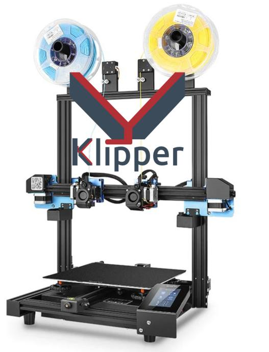
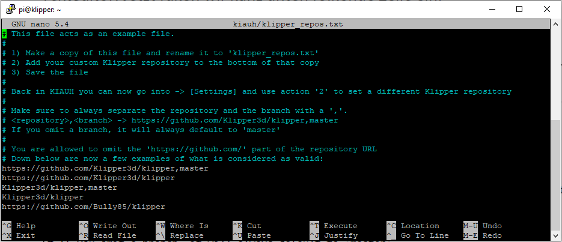
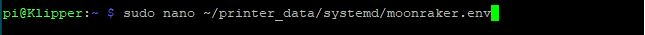
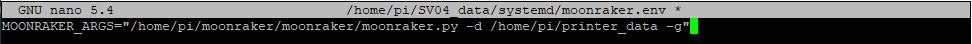

# Sovol-SV04-Klipper
Dieses Repository enthält alle notwendigen Konfigurationsdateien, damit der SV04 mit den Spiegel- und Kopiermodi von Klipper funktioniert, einschließlich Bilder und Beschreibungen.




# Spenden

[](https://www.paypal.com/donate/?hosted_button_id=L85ULXXQKALP6)


# Einleitung

Als erstes solltet Ihr überprüfen, welchen Chip Ihr habt. Entweder Ihr öffnet den Elekronikkasten und schaut was auf eurem Chip steht oder ihr guckt in Mainsail unter 'Machine -> System Loads -> mcu'.

Diese Anleitung beschreibt, wie ihr euren SV04, inklusive der COPY und MIRROR modi, Klippern könnt.

# update
Achtung, die configs haben sich mit dem neuen Update geändert. Bitte fügen Sie IDEX_mode.cfg, Macros.cfg und Start-End-Macro.cfg erneut ein. Wenn das Display benötigt wird, befinden sich diese im Ordner config/SV04-with-display. Andernfalls kann bei installiertem Original-Klipper auch config/SV04-works-with-orign-klipper verwendet werden, jedoch ohne das original Display

solltet ihr neu installieren befolgt weiter diese Anleitung
# In Arbeit..
Momentan wird Cura 5.3 nicht untersützt ! wir arbeiten aber dran... 


# Was geht alles?!!!

- Copy-Modus (unterstützt verschiedene Temperaturen, aber nicht die firstlayer Einstellungen für den rechten Extruder)
- Mirror-Modus (unterstützt verschiedene Temperaturen, aber nicht die firstlayer Einstellungen für den rechten Extruder)
- Dual Mode
- Single Mode
- Bed Mesh Levelling
- Input Shaper
- Das Display geht
- uvm.


# Benötigt
- Raspberry Pi mit W-Lan
- Optional aber empfohlen: Original 7“ Touchscreen
- Optional: Kamera
- SSH; Zum Beispiel:
    - Powershell und Windows Terminal haben SSH integriert
    - alternativ Putty oder ein anderes SSH-Programm (https://putty.org/)
- SFTP oder SCP; Zum Beispiel:
    - FileZilla (https://filezilla-project.org/)
    - WinScp (https://winscp.net)
- Pi Imager (https://www.raspberrypi.com/software/)
- Die von mir erstellten Config Dateien
- MicroSD-Karte für den Raspi (mindestens 8GB, die komplette Installation beträgt etwa 5,5GB)
- SD-Karte zum Flashen des SV04 (maximal 8GB, formatiert in Fat32 4096)


# Installation

Das Betriebssystem für den Raspberry findet ihr im Verzeichniss "[image Raspberry PI 3_4](https://drive.google.com/drive/folders/1rZepxzwUR5QTXRXcv5EBYin_gFiMcKVD)". 
Dieses wird mit Hilfe des [Raspberry Pi Imagers](https://www.raspberrypi.com/software/) auf die MicroSD-Karte gespielt. 
Achtet darauf gleich eure Wifi-Einstellungen anzupassen (diese findet ihr wenn ihr unten rechts auf das Zahnrad klickt). 

Die firmware.bin im Verzeichnis "Firmware bin" kommt auf die (große)SD-Karte und wird mit ausgestecktem original Display (wird vorerst nicht mehr benötigt, da es nicht mehr funktioniert) auf den Drucker geflasht. 
Die Dateien aus dem "config" verzeichniss werden dann, [wie unten beschrieben](#dateiübertragung) oder direkt im Mainsail Interface, auf den Raspberry übertragen. Sobald der Pi gestartet ist, kann das Interface per IP oder Hostname erreicht werden.


# Installation auf einem bestehendem OS

# Ohne Kiauh

beschreibung folgt .....


# Solltet ihr Kiauh nutzen
Folgt zuerst den [Kiauh](https://github.com/th33xitus/kiauh) Anweisungen und kommt dann zurück.

- Meldet euch per ssh beim Raspi an und gebt folgenden befehl ein:
```sh
sudo nano kiauh/klipper_repos.txt.example
```

- Dort fügt ihr am Ende der Datei die folgende Zeile ein (siehe Bild):
```sh
https://github.com/Bully85/klipper
```


- Speichert die Datei mit Ctrl+X -> Y
- Löscht das '.example' vom Ende des Dateinamens
- und öffnet Kiauh mit dem Befehl
```sh
./kiauh/kiauh.sh
```
- Hier wählen wir [6] Settings
- Dann [1] Set custom Klipper repository
- Dann [4] Bully85/klipper
- Und alles mit [ y ] bestätigen.

Fertig mit SSH


# Installation auf einem neuen OS

Installiert mit dem Raspi Imager das Mainsail OS aus 'Other specific-purpose OS' -> '3D printing' -> 'Mainsail OS'.
Startet dann euren Raspi, verbindet euch über SSH und installiert [Kiauh](https://github.com/th33xitus/kiauh).
Folgt den [vorherigen Schritten](#solltet-ihr-kiauh-nutzen), um die Standard-Klipper-Installation durch diese zu ersetzen.
Sobald ihr fertig seid, verbindet euch über SFTP/SCP und übertragt alle Dateien aus dem 'config'-Ordner dieses Repos in 'printer_data/config/'.
Startet den Raspi zur Sicherheit neu, und ihr seid fertig.


# Benutzung von SSH 

Ihr könnt SSH über eine [grafische Oberfläche](#benötigt) verwenden, oder über das Terminal.
Wenn ihr Putty benutzt, folgt deren Anweisungen.
Das Terminal ist schon installiert und normalerweise schneller.

- öffnet das Windows-Terminal (es heißt Terminal, nicht das alte CMD) oder Powershell
- verbindet euch mit 'ssh benutzername@hostname' und gebt Passwort ein
    - Benutzername und Hostname sind die, die ihr [oben](#installation-auf-einem-bestehenden-os) eingerichtet habt
    - wenn ihr auf ein bestehendes OS installiert, kennt ihr euren Benutzer- und Hostnamen hoffentlich schon/noch
- macht zeugs...
- zum Beenden Ctrl+D drücken


# Dateiübertragung 

Nun müssen die Dateien und Ordner aus dem "config"-Verzeichnis auf den Raspberry Pi kopiert werden. Standardmäßig in "printer_data".
Sollte dies bei euch nicht der Fall, passt bitte die Pfade in den Config- und .sh-Dateien an.

Am einfachsten geht das über ein SFTP- oder SCP-Programm, wie z.B. [FileZilla oder WinScp](#benötigt)


# Behebung der 'ungültig' Anzeige in Mainsail

meldet euch per SSH bei Klipper an und führt den folgenden Befehl aus:
```sh
sudo nano ~/printer_data/systemd/moonraker.env
```


Fügt "-g" am Ende der "MOONRAKER_ARGS"-Zeile an:


Speichern und Datei schließen.
Dann ein Neustart


In Mainsail klickt auf 'ungültig' und führt eine Soft Repair durch. 

fertig!!!!!
