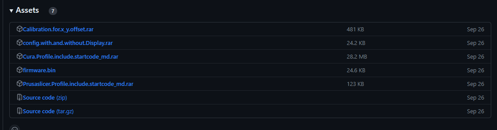

# Sovol-SV04-Klipper
Dieses Repository enthält alle notwendigen Konfigurationsdateien, damit der SV04 mit den Spiegel- und Kopiermodi von Klipper funktioniert, einschließlich Bilder und Beschreibungen.

Bitte benutzt stets das neueste Release zum Download. "[Release](https://github.com/Bully85/Sovol-SV04-Klipper/releases)"


# Spenden

[](https://www.paypal.com/donate/?hosted_button_id=L85ULXXQKALP6)


# new
Click here for the Discord https://discord.gg/8Svd9usX

# update
Achtung, die configs haben sich mit dem neuen Update (Version 1.0.1 vom 26.09.2023) geändert. Bitte fügt IDEX_mode.cfg, Macros.cfg und Start-End-Macro.cfg erneut ein.
Wenn das Display benötigt wird, befinden sich die Dateien im Ordner config/SV04-with-display. Andernfalls kann bei installiertem Original-Klipper auch config/SV04-works-with-orign-klipper verwendet werden, jedoch ohne das original Display

Wechselt auch den Startcode im Slicer [Cura](Cura Profile/Startcode.md) [Prusa_Slicer](Prusaslicer Profile/Startcode.md)


# Einleitung

Verschiedene Konfigurationen sind je nach verbautem Chip notwendig. Bitte verwendet entweder **[include chip_GD32.cfg]** oder **[include chip_STM32.cfg]** in der "printer.cfg".
Ihr könnt das durch öffnen und nachschauen in Eurem Elekronikkasten tun. Oder ihr tauscht die Konfig, wenn die Z-Tilt Funktion einen Fehler bringt. Bei korrekter Auswahl funktioniert das Z-Tilt korrekt.

Diese Anleitung beschreibt, wie ihr euren SV04, inklusive der COPY und MIRROR modi, Klippern könnt.

# In Arbeit..
Momentan wird Cura 5.3 nicht unterstützt ! wir arbeiten aber dran... 


# Was geht alles?!!!

- Copy-Modus (unterstützt verschiedene Temperaturen, aber nicht die firstlayer Einstellungen für den rechten Extruder)
- Mirror-Modus (unterstützt verschiedene Temperaturen, aber nicht die firstlayer Einstellungen für den rechten Extruder)
- Dual Mode
- Single Mode
- Bed Mesh Levelling
- Input Shaper
- Das Display geht
- uvm.


# Benötigt
- Raspberry Pi mit W-Lan
- Optional aber empfohlen: Original 7“ Touchscreen
- Optional: Kamera
- SSH; Zum Beispiel:
    - PowerShell und Windows Terminal haben SSH integriert
    - alternativ Putty oder ein anderes SSH-Programm (https://putty.org/)
- SFTP oder SCP; Zum Beispiel:
    - FileZilla (https://filezilla-project.org/)
    - WinScp (https://winscp.net)
- Pi Imager (https://www.raspberrypi.com/software/)
- Die von mir erstellten Config Dateien
- MicroSD-Karte für den Raspi (mindestens 8GB, die komplette Installation beträgt etwa 5,5GB)
- SD-Karte zum Flashen des SV04 (maximal 8GB, formatiert in Fat32 4096)


# Installation mit vorkonfiguriertem OS Image
Das Betriebssystem für den Raspberry findet ihr im Verzeichnis "[image Raspberry PI 3_4](https://drive.google.com/drive/folders/1rZepxzwUR5QTXRXcv5EBYin_gFiMcKVD)". 
Dieses wird mit Hilfe des [Raspberry Pi Imagers](https://www.raspberrypi.com/software/) auf die MicroSD-Karte gespielt. 
Achtet darauf gleich eure Wifi-Einstellungen anzupassen (diese findet ihr wenn ihr unten rechts auf das Zahnrad klickt). 
Hier findet ihr eine gute Anleitung dazu [Pi Imager Guide](https://raspberrytips.com/raspberry-pi-imager-guide/).

## Download der Konfigurationsdaten
Ladet bitte die Dateien (Source code (zip)) oder (Source code (tar.gz)) aus dem aktuellen Repository über die **Latest Release** Funktion rechts herunter.




Extrahiert die Archivdatei dann auf Eurer Workstation / PC.


## Flashen der Firmware
Es gibt 2 Optionen innerhalb dieses Repositorys.
Der Drucker kann mit funktionierendem und aktivierten Display betrieben werden. Er kann aber auch ohne das Display betrieben werden.

### Flashen der Firmware ohne funktionierendes Display

Die "firmware.bin" im Verzeichnis "Firmware bin" kommt auf die (große)SD-Karte und wird mit ausgestecktem original Display (wird vorerst nicht mehr benötigt, da es nicht mehr funktioniert) auf den Drucker geflasht. 
Nach erfolgreichem flashen geht es weiter mit "Transferieren der Konfig-Files"

### oder flashen der Firmware mit aktiviertem Display

Als erstes wird der Drucker mit der "firmware.bin" aus dem Verzeichnis "Firmware bin" geflashed. Dazu die Datei auf die (große) SD kopieren und mit ausgestecktem Display flashen.
Damit das Display mit Klipper funktioniert, muss auch das Display geflashed werden. Dazu muss das Display vom Drucker demontiert werden.

- Bereitet eine microSD Karte vor. Formatiert die Karte mit dem **FAT32 Filesystem** und einer Sektor Größe von **4096 bytes**. Diese Parameter sind wichtig. Ansonsten kann der Flash-Prozess fehlschlagen.
- Ladet den Display Code über den grünen Knopf "Code" als "Download as ZIP-File" von [Bully85/DGUS-SV04 repository(https://github.com/Bully85/DGUS-SV04/tree/master)] auf Eurenen PC / Workstation.
- Extrahiert den Ordner **DWIN_SET** aus dem Ordner **\DGUS-SV04-master\project** der Zip-Datei auf die vorher vorbereitete microSD-Karte. **DWIN_SET** muss sich dabei auf der obersten Ebene des Dateisystems der Karte befinden und alle Dateien beinhalten.
- Werft die Karte sicher aus und entnehmt sie dem Karenleser.
- Schaltet nun den Drucker aus und entfernt ALLLE Kabel. Also Strom und auch das USB-Kabel zum MiniPC/Raspi.
- Baut das Display vom Drucker ab und entfernt die hintere Abdeckung des Displays. Dort befindet sich der Kartenleser.
- Setzt die microSD-Karte in den Kartenleser. Steckt auch das Kabel vom Display zum Drucker wieder an, falls es entfernt worden ist. Lasst das USB-Kabel zum MicroPC abgezogen.
- Schaltet den Drucker ein.
- Nach wenigen Sekunden startet der Flash-Vorgang. Das Display ändert die Farbe auf blau. Schaltet den Drucker während dieses Vorganges auf keinen Fall aus.
- Wenn der Flash-Vorgang beendet ist, zeigt das Display eine **END MESSAGE** und eine Zusammenfassung des Flash-Vorganges am oberen Display an. Jetzt kann der Drucker ausgeschaltet werden.
- Entfernt die microSD Karte nun und baut das Display wieder an.
- Ein gutes Video des Flash-Prozesses gibt es auf [youtube](https://www.youtube.com/watch?v=R-G8LymhiGI&t=2s). Bitte verwendet auf keinen Fall die im Video gezeigten Dateien. Schaut Euch nur den Vorgang an.


# Transferieren der Konfig-Files
Die Konfigurationsfiles müssen nun auf den MiniPC übertragen werden.
- Kopiert die Dateien aus **Config/Sv04-works-with-origin-Klipper** wenn das Display **nicht** benutzt wird.
- **ODER** kopiert die Dateien aus **Config/SV04-with-display** wenn das Display zuvor **geflashed** wurde.

Die Dateien müssen in das Verzeichnis Eurer Klipper Instanz kopiert werden. Standard ist "printer_data". Sollte dies bei Euch anders sein, müsst ihr die Pfade Eurer config und .sh Dateien anpassen.

Der einfachste Weg die Dateien zu transferieren ist mit einem SFTP oder SCP Programm. FileZilla oder WinSCP [oben erwähnt](#requirements) funktionieren gut. Es ist aber auch möglich, die "Upload File" Funktion des Web-Interfaces Eurer neuen Mainsail Instanz zu benutzen. Ihr kommt mit http://*ip-deiner-instanz*/config auf die Oberfläche.
- Der Hostname ist der Name den ihr in den WiFi Einstellungen im Pi Imager angegeben habt.
- Die IP Adresse findet ihr auf Eurem Router

# Installation auf einem bestehendem OS

# Ohne Kiauh

Beschreibung folgt .....


# Solltet ihr Kiauh nutzen
Folgt zuerst den [Kiauh](https://github.com/th33xitus/kiauh) Anweisungen und kommt dann zurück.

- Meldet euch per ssh beim Raspi an und gebt folgenden Befehl ein:
```sh
sudo nano kiauh/klipper_repos.txt.example
```

- Dort fügt ihr am Ende der Datei die folgende Zeile ein (siehe Bild):
```sh
https://github.com/Bully85/klipper
```


- Speichert die Datei mit Ctrl+X -> Y
- Löscht das '.example' vom Ende des Dateinamens
- und öffnet Kiauh mit dem Befehl
```sh
./kiauh/kiauh.sh
```
- Hier wählen wir [6] Settings
- Dann [1] Set custom Klipper repository
- Dann [4] Bully85/klipper
- Und alles mit [ y ] bestätigen.

Fertig mit SSH


# Installation auf einem neuen OS

Installiert mit dem Raspi Imager das Mainsail OS aus 'Other specific-purpose OS' -> '3D printing' -> 'Mainsail OS'.
Startet dann euren Raspi, verbindet euch über SSH und installiert [Kiauh](https://github.com/th33xitus/kiauh).
Folgt den [vorherigen Schritten](#solltet-ihr-kiauh-nutzen), um die Standard-Klipper-Installation durch diese zu ersetzen.
Sobald ihr fertig seid, verbindet euch über SFTP/SCP und übertragt alle Dateien aus dem 'config'-Ordner dieses Repos in 'printer_data/config/'.
Startet den Raspi zur Sicherheit neu, und ihr seid fertig.


# Benutzung von SSH 

Ihr könnt SSH über eine [grafische Oberfläche](#benötigt) verwenden, oder über das Terminal.
Wenn ihr Putty benutzt, folgt deren Anweisungen.
Das Terminal ist schon installiert und normalerweise schneller.

- öffnet das Windows-Terminal (es heißt Terminal, nicht das alte CMD) oder PowerShell
- verbindet euch mit 'ssh benutzername@hostname' und gebt Passwort ein
    - Benutzername und Hostname sind die, die ihr [oben](#installation-auf-einem-bestehenden-os) eingerichtet habt
    - wenn ihr auf ein bestehendes OS installiert, kennt ihr euren Benutzer- und Hostnamen hoffentlich schon/noch
- macht Zeugs...
- zum Beenden Ctrl+D drücken

# Behebung der 'ungültig' Anzeige in Mainsail

meldet euch per SSH bei Klipper an und führt den folgenden Befehl aus:
```sh
sudo nano ~/printer_data/systemd/moonraker.env
```


Fügt "-g" am Ende der "MOONRAKER_ARGS"-Zeile an:


Speichern und Datei schließen.
Dann ein Neustart


In Mainsail klickt auf 'ungültig' und führt eine Soft Repair durch. 

fertig!!!!!

# Weiterführende Schritte

Nach der erfolgreichen Installation und dem Flashen Eures Druckers, sind weitere, Klipper spezifische Schritte, zu erledigen.
Hauptsächlich sind dies:

- Kalibrieren der Temperatur Einstellungen (PID Einstellungen) für die Extruder und das Heizbett.
- Kalibrieren der E-Steps der Extruder
- Kalibrieren des BL-Touch Sensors
- Ermitteln und einstellen der Resonanzwerte
- "Pressure Advance" Werte ermitteln und einstellen
- Einstellen der X, Y und Z- Offsets der Extruder
- ...

Die meisten dieser Schritte werden auf der Klipper Homepage detailliert erläutert [Klipper Homepage](https://www.klipper3d.org/)

Außerdem ist es sehr wichtig, die Start Codes in Eurer Slicer Software anzupassen. Bitte schaut dazu in die **Cura Profile** oder **Prusaslicer Profile** Verzeichnisse.
Bitte beachtet, das derzeit nur Cura bis Version <= 5.2 unterstützt wird. Bei höheren Versionen kommt es derzeit noch zu Problemen mit Copy, Mirror und Dual Modus.

